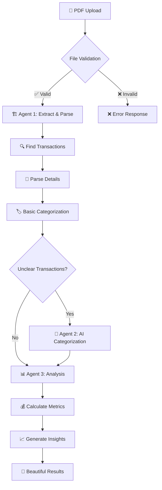

# 🏦 Bank Statement Analyzer
*AI-powered financial analysis through intelligent multi-agent processing. *
*Video Presentation - [Click Here](https://www.youtube.com/watch?v=kiBZ86F8_SU)*

[](https://python.org)
[](https://streamlit.io)
[](https://anthropic.com)

## 📋 Table of Contents

- [🎯 Overview](#-overview)
- [✨ Key Features](#-key-features)
- [🏗️ System Architecture](#️-system-architecture)
- [🚀 Quick Start](#-quick-start)
- [💻 Usage](#-usage)
- [📁 Project Structure](#-project-structure)
- [🧪 Testing](#-testing)
- [⚠️ Important Notes](#️-important-notes)
- [🏆 Key Achievements](#-key-achievements)

---

## 🎯 Overview

Transform PDF bank statements into comprehensive financial insights using a hybrid multi-agent system. The analyzer combines deterministic processing with strategic AI usage to deliver fast, accurate, and cost-effective financial analysis.

**The Problem**: Manual bank statement analysis is time-consuming and error-prone  
**The Solution**: Automated system that reads, categorizes, and analyzes transactions with minimal AI costs

---

## ✨ Key Features

🚀 **Smart PDF Processing** - Handles multiple bank formats (Chase, Wells Fargo, etc.)  
🧠 **Hybrid Categorization** - 70% deterministic + 30% AI-powered for optimal efficiency  
📊 **Comprehensive Analysis** - Spending patterns, category breakdowns, financial insights  
🎨 **Beautiful Web Interface** - Professional Streamlit dashboard with interactive charts  
💰 **Cost Optimized** - Complete analysis for ~$0.002 per statement  

---

## 🏗️ System Architecture

### Three-Agent Design

```
🏗️ Agent 1: Document Processor (0 LLM)
├── PDF extraction & transaction parsing  
├── Basic categorization via keywords
└── Handles 70% of transactions instantly

🧠 Agent 2: Content Analyzer (1 LLM)  
├── AI categorization for unclear transactions
├── Batch processing for efficiency
└── Handles remaining 30% intelligently

📊 Agent 3: Analysis Generator (0-1 LLM)
├── Financial calculations & insights
├── Report generation & visualizations  
└── Optional AI recommendations
```

### The Journey of Your Data 📈



### Processing Intelligence 🎯

```
📄 PDF Bank Statement
    ↓ 
🔍 Validation → 🏗️ Agent 1: Extract & Parse → 🏷️ Basic Categorization (70% done!)
    ↓
🧠 Agent 2: AI handles unclear cases (30%) → ✅ 100% categorized
    ↓  
📊 Agent 3: Financial analysis → 💡 Insights → 🎨 Beautiful dashboard
```

---

## 🚀 Quick Start

### Installation
```bash
# Setup
git clone <repository-url>
cd bank_statement_analyzer
python -m venv venv
source venv/bin/activate

# Install dependencies
pip install -r requirements.txt

# Configure API key
echo "ANTHROPIC_API_KEY=your_key_here" > .env

# Launch web interface
streamlit run streamlit_app.py
```

### First Analysis
1. Open browser to `http://localhost:8501`
2. Upload bank statement PDF
3. Choose analysis options
4. View interactive results

---

## 💻 Usage

### Web Interface (Recommended)
```bash
streamlit run streamlit_app.py
```
Professional dashboard with drag-and-drop upload and interactive visualizations.

### Command Line
```bash
python main_coordinator.py
```
Terminal interface for batch processing and automation.

### Python API
```python
from main_coordinator import BankStatementAnalyzer

analyzer = BankStatementAnalyzer("your-api-key")
result = analyzer.analyze_statement("statement.pdf")
```

---

## 📁 Project Structure

```
bank_statement_analyzer/
├── streamlit_app.py              # Web interface
├── main_coordinator.py           # System orchestration
├── agents/                       # Core agents
│   ├── document_processor.py     # Agent 1: PDF processing
│   ├── content_analyzer.py       # Agent 2: AI categorization
│   └── analysis_generator.py     # Agent 3: Financial analysis
├── utils/                        # Shared utilities
│   ├── llm_interface.py          # AI management
│   └── merchant_database.py      # Categorization rules
├── tests/                        # Test suite
└── bank_statements/              # Sample data
```

---

## 🧪 Testing

### Run Tests
```bash
# Complete system test
python -m tests.test_complete_system

# Individual components
python -m tests.test_agent1    # PDF processing
python -m tests.test_agent2    # AI categorization
```

### Test Coverage
- End-to-end system integration
- Individual agent functionality  
- Error handling and edge cases
- Performance validation
- Multi-format PDF compatibility

---

## ⚠️ Important Notes

### 🔒 Security Warning

**⚠️ EDUCATIONAL PROJECT ONLY**

This system is designed for learning purposes and lacks production security requirements:
- No encryption for sensitive data
- No secure authentication systems
- No regulatory compliance features

**For educational use only** - Use synthetic data or heavily redacted samples.

### 💡 Development Philosophy

**"Use AI only where it adds unique value"**

- **Deterministic First**: Handle obvious cases (Starbucks → Food) without AI
- **Strategic AI**: Use intelligence for truly ambiguous transactions  
- **Cost Conscious**: Batch processing minimizes API usage
- **Reliable Foundation**: Consistent results through deterministic processing

---

## 🏆 Key Achievements

### Technical Excellence
- **Hybrid Architecture**: Optimal balance of speed, accuracy, and cost
- **Multi-Format Support**: Robust PDF processing across bank types
- **Professional Interface**: Web dashboard with interactive visualizations
- **Performance Optimization**: 70% deterministic processing reduces costs significantly

### Innovation
- **Intelligent Resource Usage**: AI used strategically where most valuable
- **Batch Optimization**: Single AI call handles multiple unclear transactions
- **Extensible Design**: Easy to add new banks, categories, and features
- **User Experience**: Makes financial data analysis accessible and enjoyable

---

*Transform your financial data into insights that matter* 💰✨